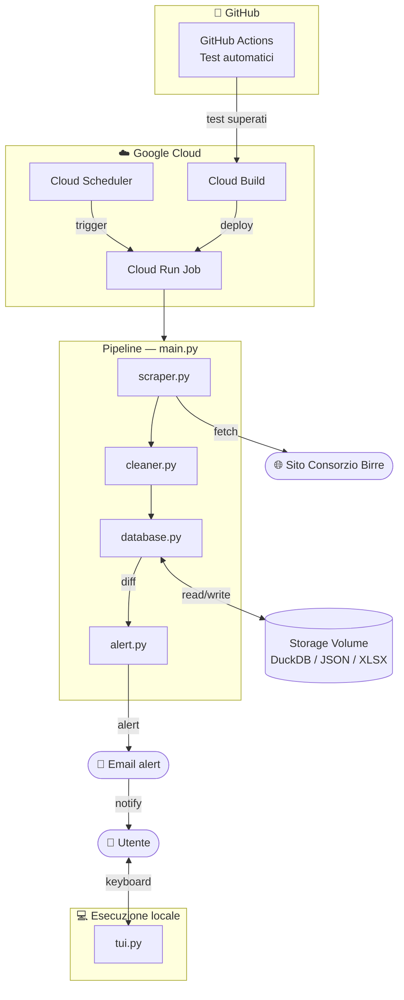

# 🍺 Consorzio Birre

Pipeline automatizzata che monitora le variazioni del menu del **Consorzio Birre** e invia notifiche email a ogni cambiamento rilevato.

- [🍺 Consorzio Birre](#-consorzio-birre)
  - [Panoramica](#panoramica)
  - [Architettura](#architettura)
  - [Storico](#storico)
  - [Infrastruttura](#infrastruttura)
  - [Qualità del codice (CI)](#qualità-del-codice-ci)
  - [Interfaccia locale (TUI)](#interfaccia-locale-tui)
  - [Struttura del progetto](#struttura-del-progetto)
  - [Setup locale](#setup-locale)

## Panoramica

Lo scraper viene eseguito due volte al giorno su `Google Cloud`: recupera il menu corrente, lo confronta con l'ultima versione (se presente) e in caso di differenze invia un'email di notifica. Nessun intervento manuale richiesto.
In caso di anomalie temporanee del sito (es. blocchi o pagine vuote), lo script interrompe l'esecuzione, invia un alert email dedicato e proverà a rieseguire una volta il job subito dopo.
In ambiente locale, lo script disabilita la modalità *headless* per offrire una TUI (**Terminal User Interface**) interattiva per navigare il menu, effettuare ricerche e consultare aggregazioni, il tutto da tastiera.  

---

## Architettura



1. **Scraping** — Recupera e analizza il menu con `requests` e `BeautifulSoup`
2. **Pulizia** — Normalizza i dati grezzi con `pandas` e `re` (stdlib).
3. **Persistenza** — `duckdb` salva il risultato con storico completo delle modifiche (**SCD Type 2**). Per ogni esecuzione si generano degli snapshot testuali (`.json` + `.xlsx`).
4. **Alert** — Notifica SMTP inviata in presenza di variazioni, completa di allegati `.csv` generati al volo in memoria con i dettagli dei cambiamenti.
5. **TUI** — In esecuzione locale, interfaccia interattiva a terminale per navigare e interrogare i dati

---

## Storico

Grazie alla logica SCD Type 2 (**SlowlyChangingData Type 2**), il database garantisce la piena auditability del dato: ogni variazione di prezzo o disponibilità è storicizzata, permettendo di ricostruire l'esatta evoluzione del menu nel tempo.

---

## Infrastruttura

| Componente | Servizio |
| --- | --- |
| Runtime | Google Cloud Run Job |
| Scheduling | Google Cloud Scheduler (2/gg) |
| Storage | Volume montato su Cloud Run / Ambiente Locale |
| CI/CD | Google Cloud Build |
| Container | Docker |

---

## Qualità del codice (CI)

Il repository include una suite di test unitari e d'integrazione (descritta in [tests/README.md](./tests/README.md)) che simulano offline il comportamento senza usare la rete o il database reale.

Tramite **GitHub Actions**, a ogni aggiornamento del codice i test vengono eseguiti automaticamente in un ambiente isolato. Se i test non sono tutti verdi, il deploy sul cloud viene bloccato per prevenire il caricamento di dati errati.

---

## Interfaccia locale (TUI)

In locale, lo script rileva l'assenza della variabile d'ambiente `HEADLESS` e avvia una TUI navigabile da tastiera che consente di:

- **Sfogliare** — navigazione per categoria tra le voci disponibili
- **Ricercare** — filtro testuale in tempo reale su nome e descrizione
- **Consultare statistiche** — numero di articoli, prezzo massimo, prezzo minimo, etc.

Su `Cloud Run` la stessa variabile d'ambiente, impostata direttamente nella configurazione del Job, disabilita la TUI e lascia girare la pipeline in modalità headless.

---

## Struttura del progetto

```plain

├── .github/workflows/
│   └── ci.yml          # Configurazione GitHub Actions
├── main.py             # Punto di ingresso e gestione errori
├── core/
│   ├── scraper.py      # Download e parsing HTML
│   ├── cleaner.py      # Normalizzazione dati
│   ├── database.py     # Logica database e storicizzazione
│   ├── alert.py        # Invio notifiche e avvisi di errore
│   ├── tui.py          # Terminale interattivo per l'utente
│   ├── const.py        # Costanti e percorsi
│   └── colors.py       # Gestione dell'output testuale
└── tests/
    └── README.md       # Dettagli ed esecuzione della suite di test
```

## Setup locale

1. Clonare il repository: `git clone https://github.com/m-contini/Consorzio.git`
2. Creare ambiente virtuale: `python -m venv venv && source venv/bin/activate`
3. Installare le dipendenze: `python -m pip install -r requirements.txt`
4. Creare apposito file `.env` basato su `env.example` (richiede API key di `Google Cloud`).
5. Avvia: `python main.py`
